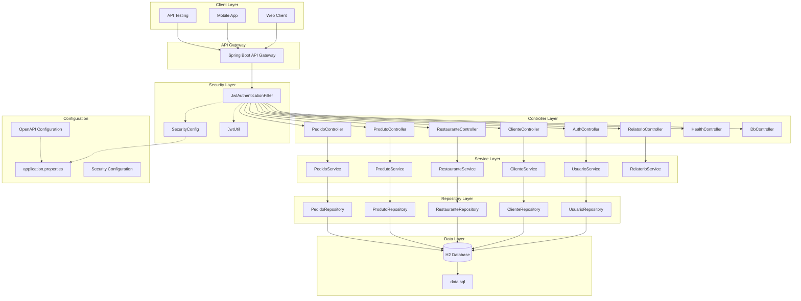
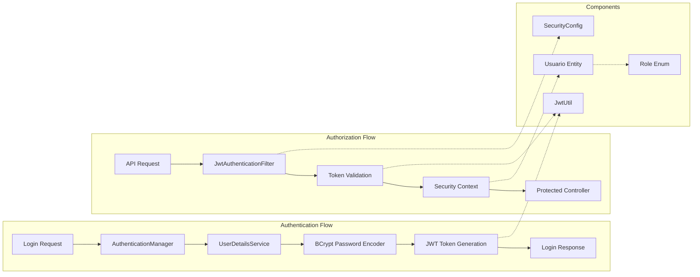
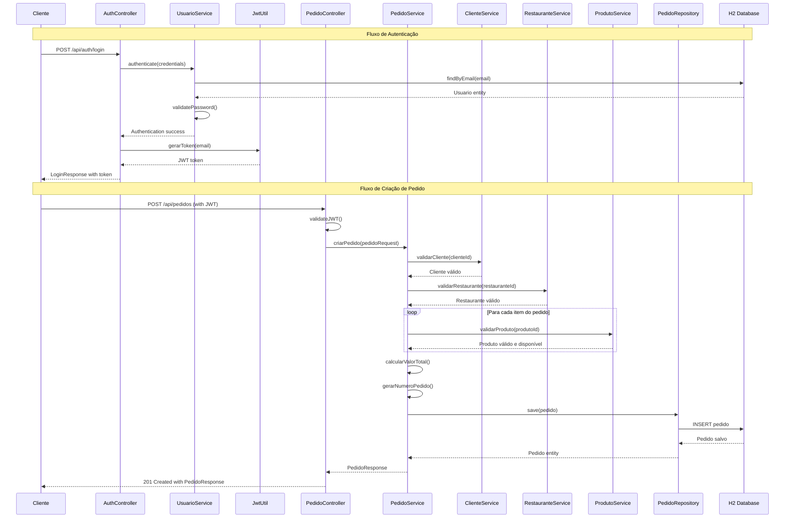
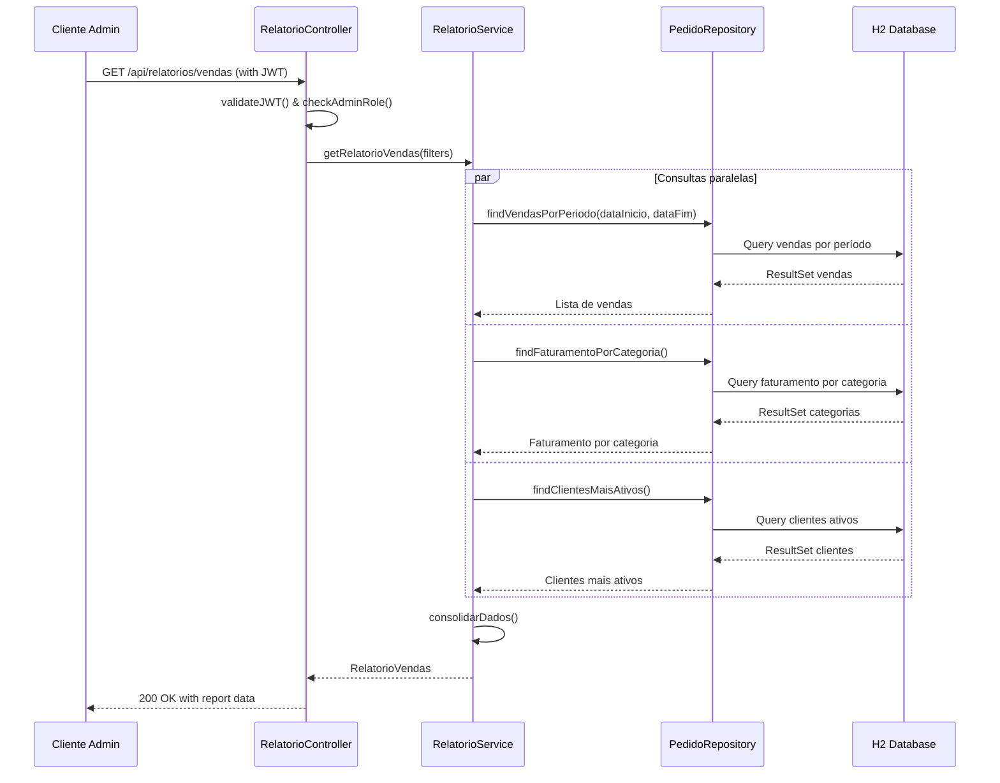

# Sistema de Diagramas - Delivery API

Este documento contém os diagramas Mermaid solicitados para o sistema de delivery API.

## 1. Diagrama de Arquitetura

### Arquitetura Geral do Sistema



### Arquitetura de Segurança JWT



## 2. Diagrama de Sequência

### Fluxo de Autenticação e Criação de Pedido



### Fluxo de Consulta de Relatórios



## 3. Mapa de Transações CRUD

### Operações CRUD por Entidade

```mermaid
graph TD
    subgraph "Cliente Operations"
        CC[ClienteController]
        CC --> C_CREATE[POST /api/clientes<br/>Criar cliente]
        CC --> C_READ[GET /api/clientes/{id}<br/>Buscar cliente]
        CC --> C_LIST[GET /api/clientes<br/>Listar clientes]
        CC --> C_UPDATE[PUT /api/clientes/{id}<br/>Atualizar cliente]
        CC --> C_DELETE[DELETE /api/clientes/{id}<br/>Soft delete cliente]
        
        C_CREATE --> CS[ClienteService]
        C_READ --> CS
        C_LIST --> CS
        C_UPDATE --> CS
        C_DELETE --> CS
        
        CS --> CR[ClienteRepository]
        CR --> CDB[(Cliente Table)]
    end
    
    subgraph "Restaurante Operations"
        RC[RestauranteController]
        RC --> R_CREATE[POST /api/restaurantes<br/>Criar restaurante]
        RC --> R_READ[GET /api/restaurantes/{id}<br/>Buscar restaurante]
        RC --> R_LIST[GET /api/restaurantes<br/>Listar restaurantes]
        RC --> R_UPDATE[PUT /api/restaurantes/{id}<br/>Atualizar restaurante]
        RC --> R_DELETE[DELETE /api/restaurantes/{id}<br/>Soft delete restaurante]
        
        R_CREATE --> RS[RestauranteService]
        R_READ --> RS
        R_LIST --> RS
        R_UPDATE --> RS
        R_DELETE --> RS
        
        RS --> RR[RestauranteRepository]
        RR --> RDB[(Restaurante Table)]
    end
    
    subgraph "Produto Operations"
        PC[ProdutoController]
        PC --> P_CREATE[POST /api/produtos<br/>Criar produto]
        PC --> P_READ[GET /api/produtos/{id}<br/>Buscar produto]
        PC --> P_LIST[GET /api/produtos<br/>Listar produtos]
        PC --> P_UPDATE[PUT /api/produtos/{id}<br/>Atualizar produto]
        PC --> P_DELETE[DELETE /api/produtos/{id}<br/>Soft delete produto]
        
        P_CREATE --> PS[ProdutoService]
        P_READ --> PS
        P_LIST --> PS
        P_UPDATE --> PS
        P_DELETE --> PS
        
        PS --> PR[ProdutoRepository]
        PR --> PDB[(Produto Table)]
    end
    
    subgraph "Pedido Operations"
        PedC[PedidoController]
        PedC --> Ped_CREATE[POST /api/pedidos<br/>Criar pedido]
        PedC --> Ped_READ[GET /api/pedidos/{id}<br/>Buscar pedido]
        PedC --> Ped_LIST[GET /api/pedidos<br/>Listar pedidos]
        PedC --> Ped_UPDATE[PUT /api/pedidos/{id}/status<br/>Atualizar status]
        PedC --> Ped_CANCEL[DELETE /api/pedidos/{id}<br/>Cancelar pedido]
        
        Ped_CREATE --> PedS[PedidoService]
        Ped_READ --> PedS
        Ped_LIST --> PedS
        Ped_UPDATE --> PedS
        Ped_CANCEL --> PedS
        
        PedS --> PedR[PedidoRepository]
        PedR --> PedDB[(Pedido Table)]
        PedR --> ItemDB[(ItemPedido Table)]
    end

    subgraph "Authentication Operations"
        AC[AuthController]
        AC --> A_LOGIN[POST /api/auth/login<br/>Autenticar usuário]
        AC --> A_REGISTER[POST /api/auth/register<br/>Registrar usuário]
        
        A_LOGIN --> US[UsuarioService]
        A_REGISTER --> US
        
        US --> UR[UsuarioRepository]
        UR --> UDB[(Usuario Table)]
    end
```

### Mapa de Transações Detalhado

```mermaid
flowchart LR
    subgraph "CREATE Operations"
        direction TB
        CreateCliente[Cliente: POST /api/clientes<br/>✓ Validação email único<br/>✓ Validação dados obrigatórios<br/>✓ Soft delete flag = false]
        CreateRest[Restaurante: POST /api/restaurantes<br/>✓ Validação email único<br/>✓ Validação categoria<br/>✓ Taxa entrega > 0]
        CreateProd[Produto: POST /api/produtos<br/>✓ Validação restaurante existe<br/>✓ Preço > 0<br/>✓ Categoria válida]
        CreatePed[Pedido: POST /api/pedidos<br/>✓ Cliente existe e ativo<br/>✓ Restaurante existe e ativo<br/>✓ Produtos disponíveis<br/>✓ Cálculo valor total]
        CreateUser[Usuario: POST /api/auth/register<br/>✓ Email único<br/>✓ Password encryption<br/>✓ Role assignment]
    end
    
    subgraph "READ Operations"
        direction TB
        ReadCliente[Cliente: GET /api/clientes/{id}<br/>✓ Filtro por excluido = false<br/>✓ Dados sensíveis omitidos]
        ReadRest[Restaurante: GET /api/restaurantes/{id}<br/>✓ Filtro por ativo = true<br/>✓ Include produtos ativos]
        ReadProd[Produto: GET /api/produtos/{id}<br/>✓ Filtro por disponivel = true<br/>✓ Include restaurante info]
        ReadPed[Pedido: GET /api/pedidos/{id}<br/>✓ Autorização por cliente<br/>✓ Include itens do pedido<br/>✓ Status tracking]
        ListAll[LIST: GET /api/{entity}<br/>✓ Paginação<br/>✓ Filtros por status<br/>✓ Ordenação por data]
    end
    
    subgraph "UPDATE Operations"
        direction TB
        UpdateCliente[Cliente: PUT /api/clientes/{id}<br/>✓ Validação email único<br/>✓ Preserve ID e timestamps<br/>✓ Audit log]
        UpdateRest[Restaurante: PUT /api/restaurantes/{id}<br/>✓ Validação dados business<br/>✓ Update avaliação média<br/>✓ Notify produtos]
        UpdateProd[Produto: PUT /api/produtos/{id}<br/>✓ Validação preço<br/>✓ Check pedidos pendentes<br/>✓ Update availability]
        UpdatePedStatus[Pedido Status: PUT /api/pedidos/{id}/status<br/>✓ Validação transição status<br/>✓ Business rules<br/>✓ Notification triggers]
    end
    
    subgraph "DELETE Operations"
        direction TB
        DeleteCliente[Cliente: DELETE /api/clientes/{id}<br/>✓ Soft delete (excluido = true)<br/>✓ Check pedidos ativos<br/>✓ Preserve histórico]
        DeleteRest[Restaurante: DELETE /api/restaurantes/{id}<br/>✓ Soft delete (ativo = false)<br/>✓ Cascade produtos<br/>✓ Check pedidos pendentes]
        DeleteProd[Produto: DELETE /api/produtos/{id}<br/>✓ Soft delete (disponivel = false)<br/>✓ Check carrinho itens<br/>✓ Preserve pedidos histórico]
        CancelPed[Pedido: DELETE /api/pedidos/{id}<br/>✓ Status = CANCELLED<br/>✓ Business rule validation<br/>✓ Refund processing]
    end
    
    subgraph "Special Operations"
        direction TB
        AuthLogin[Login: POST /api/auth/login<br/>✓ Credential validation<br/>✓ JWT generation<br/>✓ Session tracking]
        Reports[Relatórios: GET /api/relatorios/*<br/>✓ Admin authorization<br/>✓ Date range filters<br/>✓ Aggregated queries]
        Health[Health: GET /health<br/>✓ Database connectivity<br/>✓ Service status<br/>✓ No auth required]
    end
```

### Regras de Negócio por Operação

```mermaid
graph TD
    subgraph "Business Rules Matrix"
        BR1[Cliente CRUD<br/>• Email deve ser único<br/>• Telefone obrigatório<br/>• Endereço completo<br/>• Soft delete preserva histórico]
        
        BR2[Restaurante CRUD<br/>• Email único por restaurante<br/>• Categoria válida<br/>• Taxa entrega >= 0<br/>• Tempo entrega > 0<br/>• Avaliação 0-5 estrelas]
        
        BR3[Produto CRUD<br/>• Preço > 0<br/>• Restaurante deve existir<br/>• Categoria válida<br/>• Disponibilidade boolean<br/>• Soft delete via disponivel]
        
        BR4[Pedido CRUD<br/>• Cliente deve estar ativo<br/>• Restaurante deve estar ativo<br/>• Produtos devem estar disponíveis<br/>• Valor total calculado automaticamente<br/>• Status transitions controladas<br/>• Número pedido único]
        
        BR5[Usuário AUTH<br/>• Email único no sistema<br/>• Password BCrypt hash<br/>• Role obrigatória<br/>• Ativo por padrão<br/>• Data criação auto]
        
        BR6[Relatórios READ<br/>• Apenas ADMIN access<br/>• Filtros por data<br/>• Agregações calculadas<br/>• Performance optimized queries]
    end
    
    subgraph "Transaction Boundaries"
        T1[Single Entity Operations<br/>@Transactional<br/>Rollback on exception]
        T2[Complex Operations<br/>@Transactional<br/>Multiple entity updates<br/>Consistency guaranteed]
        T3[Read-Only Operations<br/>@Transactional(readOnly=true)<br/>Performance optimized]
    end
    
    BR1 --> T1
    BR2 --> T1
    BR3 --> T1
    BR4 --> T2
    BR5 --> T1
    BR6 --> T3
```