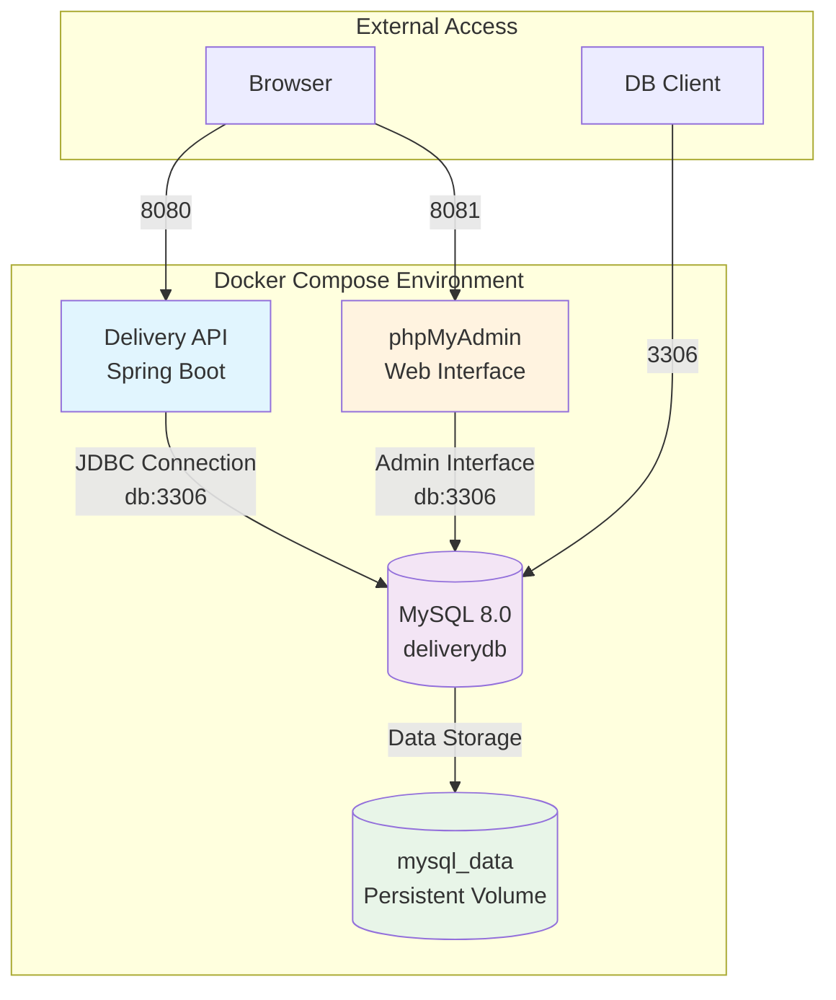

# Configuração e Integração MySQL para Delivery API

## Visão Geral

Este design documenta a migração completa da aplicação Delivery API do banco de dados H2 em memória para MySQL, incluindo:
- Configuração completa da instância MySQL
- Carregamento de dados de teste (data.sql e DataLoaders)
- Persistência de dados com volumes Docker
- Painel de controle MySQL (phpMyAdmin)
- Remoção das configurações H2
- Validação através de testes

## Arquitetura da Solução



## Configuração do MySQL

### 1. Atualização do Docker Compose

#### Estrutura de Serviços
- **app**: Aplicação Spring Boot (porta 8080)
- **db**: MySQL 8.0 com configurações otimizadas (porta 3306)  
- **phpmyadmin**: Interface web para administração (porta 8081)
- **mysql_data**: Volume persistente para dados

#### Configurações do MySQL
- **Database**: deliverydb
- **User**: deliveryuser / deliverypass
- **Root**: root / rootpass
- **Character Set**: utf8mb4_unicode_ci
- **Engine**: InnoDB com configurações otimizadas

### 2. Scripts de Inicialização

#### Estrutura de Inicialização MySQL
```
/docker-entrypoint-initdb.d/
├── 01-schema.sql          # Criação do schema
├── 02-data.sql           # Dados iniciais
└── 03-optimize.sql       # Configurações de performance
```

#### Processo de Carregamento
1. MySQL inicia e executa scripts na ordem alfabética
2. Schema é criado automaticamente pelo Hibernate
3. Dados de teste são carregados via DataLoader
4. UserDataLoader cria usuários JWT

### 3. Configuração da Aplicação

#### Dependências Maven
- Adição: `mysql-connector-j` (driver oficial MySQL)
- Remoção: `com.h2database:h2` 
- Manutenção: todas as outras dependências Spring Data JPA

#### Properties de Configuração
```properties
# MySQL Database Configuration
spring.datasource.url=jdbc:mysql://db:3306/deliverydb?useSSL=false&allowPublicKeyRetrieval=true&serverTimezone=UTC
spring.datasource.username=deliveryuser
spring.datasource.password=deliverypass
spring.datasource.driver-class-name=com.mysql.cj.jdbc.Driver

# JPA/Hibernate Configuration
spring.jpa.database-platform=org.hibernate.dialect.MySQLDialect
spring.jpa.hibernate.ddl-auto=create-drop
spring.jpa.show-sql=false
spring.jpa.properties.hibernate.format_sql=true

# MySQL specific optimizations
spring.jpa.properties.hibernate.connection.characterEncoding=utf8mb4
spring.jpa.properties.hibernate.connection.useUnicode=true
```

## Migração de Dados

### 1. Adaptação do data.sql

#### Conversão de Sintaxe H2 para MySQL
- **MERGE INTO** → **INSERT INTO ... ON DUPLICATE KEY UPDATE**
- **CURRENT_TIMESTAMP()** → **NOW()**
- **TRUE/FALSE** → **1/0** ou **'true'/'false'**

#### Exemplo de Conversão
```sql
-- H2 (Original)
MERGE INTO CLIENTE (id, nome, email, ativo, excluido) KEY(id)
VALUES (1, 'João Silva', 'joao@email.com', TRUE, FALSE);

-- MySQL (Convertido)
INSERT INTO CLIENTE (id, nome, email, ativo, excluido)
VALUES (1, 'João Silva', 'joao@email.com', 1, 0)
ON DUPLICATE KEY UPDATE
    nome = VALUES(nome),
    email = VALUES(email),
    ativo = VALUES(ativo),
    excluido = VALUES(excluido);
```

### 2. Configuração dos DataLoaders

#### UserDataLoader - Usuários JWT
- Mantém lógica atual de verificação de existência
- Criação de 4 usuários padrão (ADMIN, CLIENTE, RESTAURANTE, ENTREGADOR)
- Senhas criptografadas com BCrypt
- Execução condicionada por profiles (!test)

#### Ordem de Execução
1. **Hibernate DDL**: Criação automática do schema
2. **data.sql**: Dados básicos (clientes, restaurantes, produtos, pedidos)
3. **UserDataLoader**: Usuários JWT (@Order(100))

## Painel de Controle MySQL

### 1. Configuração phpMyAdmin

#### Características do Serviço
- **Imagem**: phpmyadmin/phpmyadmin:latest
- **Porta**: 8081
- **Auto-login**: Configurado com credenciais do MySQL
- **Interface**: Web responsiva com todas as funcionalidades MySQL

#### Configurações Automáticas
```yaml
environment:
  PMA_HOST: db
  PMA_PORT: 3306
  PMA_USER: deliveryuser
  PMA_PASSWORD: deliverypass
  PMA_ARBITRARY: 1
  MYSQL_ROOT_PASSWORD: rootpass
```

### 2. Funcionalidades Disponíveis
- Navegação completa do banco deliverydb
- Execução de queries SQL
- Import/Export de dados
- Monitoramento de performance
- Gerenciamento de usuários e privilégios

## Persistência de Dados

### 1. Configuração de Volumes

#### Volume mysql_data
- **Tipo**: Local driver
- **Localização**: `/var/lib/mysql` (container)
- **Persistência**: Dados mantidos entre restarts
- **Backup**: Suporte a dump/restore via docker exec

#### Comandos de Backup
```bash
# Backup
docker exec delivery-mysql mysqldump -u root -p deliverydb > backup_$(date +%Y%m%d).sql

# Restore
cat backup_20241210.sql | docker exec -i delivery-mysql mysql -u root -p deliverydb
```

### 2. Estratégia de Dados

#### Ambiente de Desenvolvimento
- **DDL**: `create-drop` para reset entre execuções
- **Dados**: Recriados automaticamente via DataLoaders
- **Volume**: Persistente para desenvolvimento contínuo

#### Ambiente de Produção (Futuro)
- **DDL**: `validate` ou `update`
- **Dados**: Migrations controladas
- **Backup**: Estratégia automatizada com cron jobs

## Remoção das Configurações H2

### 1. Limpeza do pom.xml
```xml
<!-- REMOVER -->
<dependency>
    <groupId>com.h2database</groupId>
    <artifactId>h2</artifactId>
    <scope>runtime</scope>
</dependency>

<!-- ADICIONAR -->
<dependency>
    <groupId>com.mysql</groupId>
    <artifactId>mysql-connector-j</artifactId>
    <scope>runtime</scope>
</dependency>
```

### 2. Limpeza do application.properties
#### Propriedades a Remover
- `spring.datasource.url` (H2)
- `spring.datasource.driverClassName` (H2Driver)
- `spring.h2.console.enabled`
- `spring.h2.console.path`
- `spring.jpa.database-platform` (H2Dialect)

#### Propriedades a Adicionar
- Configurações MySQL conforme especificado acima
- Otimizações específicas do MySQL
- Configurações de charset UTF-8

### 3. Verificação de Código
- **Controllers**: Remoção de referências ao H2 console
- **Tests**: Atualização para usar MySQL em testes de integração
- **Scripts**: Atualização de scripts de verificação de schema

## Estratégia de Testes

### 1. Testes de Build
```bash
# Maven clean compile
./mvnw clean compile

# Verificar dependências
./mvnw dependency:tree | grep mysql

# Build completo
./mvnw clean package -DskipTests
```

### 2. Testes Unitários
#### Configuração para Testes
- **Profile**: application-test.properties
- **Database**: H2 em memória para testes unitários (opcional)
- **ou**: TestContainers com MySQL para testes de integração

#### Execução de Testes
```bash
# Todos os testes
./mvnw test

# Testes específicos
./mvnw test -Dtest=ClienteServiceTest
./mvnw test -Dtest="*RepositoryTest"
```

### 3. Testes de Integração

#### Docker Compose Testing
```bash
# Subir ambiente completo
docker-compose up --build -d

# Verificar logs
docker-compose logs app
docker-compose logs db

# Testar conectividade
curl http://localhost:8080/health
curl http://localhost:8080/api/clientes
```

#### Collection Postman
- **Authentication**: Testes de login JWT
- **CRUD Operations**: Todos os endpoints principais
- **Data Validation**: Verificação de dados carregados
- **Error Handling**: Testes de cenários de erro

### 4. Validação de Dados

#### Verificação via phpMyAdmin
1. Acesso: http://localhost:8081
2. Login automático com credenciais configuradas
3. Verificação de tabelas criadas
4. Contagem de registros carregados
5. Teste de queries de relatórios

#### Verificação via API
```bash
# Clientes carregados
curl -H "Authorization: Bearer $TOKEN" http://localhost:8080/api/clientes

# Restaurantes carregados  
curl -H "Authorization: Bearer $TOKEN" http://localhost:8080/api/restaurantes

# Produtos carregados
curl -H "Authorization: Bearer $TOKEN" http://localhost:8080/api/produtos
```

## Configurações de Performance

### 1. Otimizações MySQL
```sql
-- Configurações InnoDB
innodb_buffer_pool_size = 256M
innodb_log_file_size = 64M
innodb_flush_log_at_trx_commit = 2
innodb_lock_wait_timeout = 50

-- Configurações de conexão
max_connections = 100
max_connect_errors = 1000
wait_timeout = 600
```

### 2. Otimizações JPA/Hibernate
- **Batch Processing**: Já configurado (batch_size=25)
- **Statement Caching**: Habilitado
- **Connection Pooling**: Default HikariCP
- **Lazy Loading**: Configurado com fetch joins

## Arquivos de Configuração

### 1. docker-compose.yml Atualizado
- Serviço MySQL com configurações otimizadas
- Volume persistente configurado
- phpMyAdmin pré-configurado
- Rede interna para comunicação entre serviços

### 2. application.properties Atualizado
- Configurações MySQL completas
- Remoção de todas as referências H2
- Otimizações de performance
- Configurações de charset UTF-8

### 3. pom.xml Atualizado
- Dependência MySQL adicionada
- Dependência H2 removida
- Manutenção de todas as outras dependências

### 4. data.sql Convertido
- Sintaxe MySQL nativa
- INSERT ... ON DUPLICATE KEY UPDATE
- Tipos de dados compatíveis
- Timestamp functions MySQL

## Fluxo de Implementação

### Fase 1: Preparação
1. Backup da configuração atual
2. Atualização do pom.xml (dependências)
3. Conversão do data.sql para sintaxe MySQL
4. Atualização do docker-compose.yml

### Fase 2: Configuração
1. Atualização do application.properties
2. Remoção de referências H2 no código
3. Teste de build local
4. Validação de sintaxe SQL

### Fase 3: Integração
1. Build e start do Docker Compose
2. Verificação de logs de inicialização
3. Teste de conectividade com MySQL
4. Validação do phpMyAdmin

### Fase 4: Testes
1. Execução de testes unitários
2. Execução da collection Postman
3. Testes de performance básicos
4. Validação de dados carregados

### Fase 5: Validação Final
1. Teste completo de CRUD operations
2. Verificação de relatórios
3. Teste de autenticação JWT
4. Documentação de procedimentos

## Considerações de Segurança

### 1. Credenciais
- **Desenvolvimento**: Credenciais fixas no compose
- **Produção**: Usar secrets/environment variables
- **Root Password**: Restrito ao container MySQL

### 2. Rede Docker
- **Isolamento**: Comunicação apenas entre containers do compose
- **Firewall**: Apenas portas necessárias expostas ao host
- **phpMyAdmin**: Restrito a ambiente de desenvolvimento

### 3. Dados Sensíveis
- **JWT Secret**: Mantido em application.properties
- **Passwords**: Criptografadas com BCrypt
- **Database**: Acesso apenas via usuário limitado

## Monitoramento e Troubleshooting

### 1. Logs de Monitoramento
```bash
# Logs da aplicação
docker-compose logs -f app

# Logs do MySQL
docker-compose logs -f db

# Logs do phpMyAdmin
docker-compose logs -f phpmyadmin
```

### 2. Health Checks
- **Application**: /health endpoint
- **MySQL**: Connection pool status
- **phpMyAdmin**: Web interface accessibility

### 3. Problemas Comuns
- **Connection Refused**: Verificar ordem de inicialização
- **Authentication Failed**: Verificar credenciais no properties
- **Schema Not Found**: Verificar criação automática do banco
- **Data Loading Failed**: Verificar logs do DataLoader