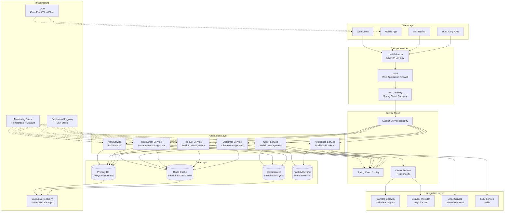
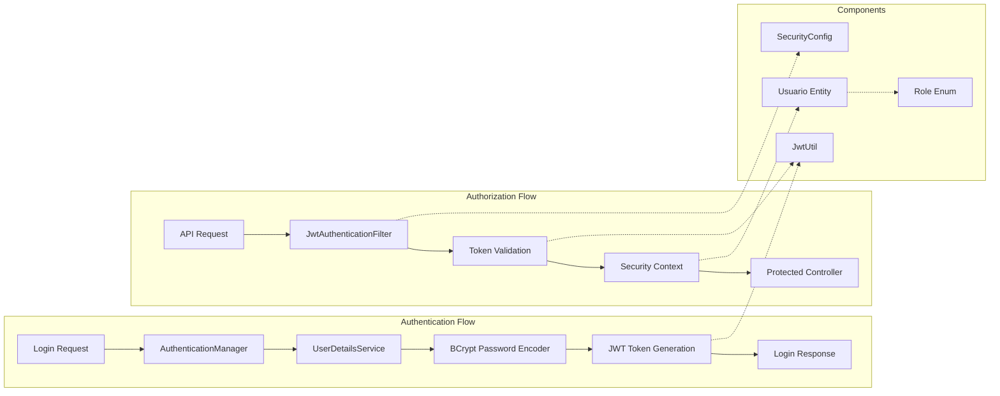

# Diagrama de Arquitetura - Delivery API

Este diagrama representa a arquitetura moderna do sistema de delivery API, incluindo padrões cloud-native e componentes de resiliência.

## Arquitetura Geral do Sistema (Cloud-Native)

## Arquitetura de Segurança JWT

## Componentes Principais

### Client Layer

- **Web Client**: Interface web para usuários finais
- **Mobile App**: Aplicação móvel para clientes e entregadores
- **API Testing**: Ferramentas como Postman para testes
- **Third Party APIs**: Integrações com sistemas externos

### Edge Services

- **API Gateway**: Ponto único de entrada, roteamento e segurança
- **Load Balancer**: Distribuição de carga entre instâncias
- **WAF**: Proteção contra ataques web comuns

### Service Mesh

- **Service Registry**: Descoberta dinâmica de serviços
- **Config Server**: Gerenciamento centralizado de configurações
- **Circuit Breaker**: Proteção contra falhas em cascata

### Application Layer

- **Auth Service**: Autenticação e autorização JWT/OAuth2
- **Order Service**: Gerenciamento completo do ciclo de pedidos
- **Restaurant Service**: CRUD e gestão de restaurantes
- **Product Service**: Catálogo de produtos e disponibilidade
- **Customer Service**: Perfil e histórico de clientes
- **Notification Service**: Notificações push, email e SMS

### Integration Layer

- **Payment Gateway**: Processamento de pagamentos (Stripe, PagSeguro)
- **Delivery Provider**: Integração com provedores de entrega
- **Email/SMS Services**: Comunicação com usuários

### Data Layer

- **Primary DB**: Banco principal (MySQL/PostgreSQL)
- **Redis Cache**: Cache de sessão e dados frequentes
- **Elasticsearch**: Busca e analytics avançados
- **Message Queue**: Streaming de eventos assíncrono

### Infrastructure

- **Monitoring**: Observabilidade com métricas e alertas
- **Logging**: Logs centralizados para troubleshooting
- **Backup**: Estratégia de backup e recuperação
- **CDN**: Distribuição de conteúdo estático
