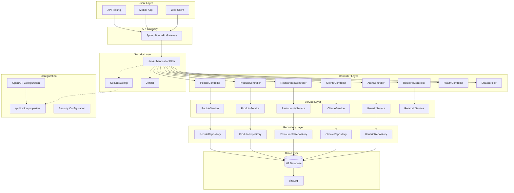
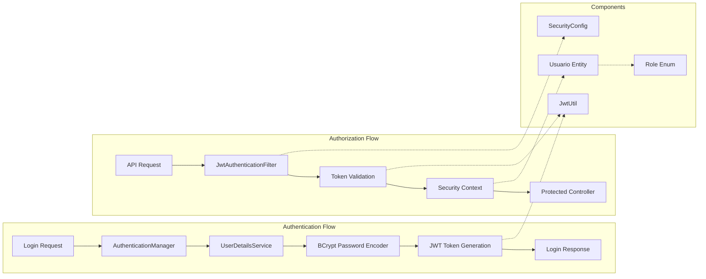

# Diagrama de Arquitetura - Delivery API

Este diagrama representa a arquitetura geral do sistema de delivery API, mostrando as camadas e componentes principais.

## Arquitetura Geral do Sistema

## Arquitetura de Segurança JWT

## Componentes Principais

### Client Layer
- **Web Client**: Interface web para usuários finais
- **Mobile App**: Aplicação móvel para clientes e entregadores
- **API Testing**: Ferramentas como Postman para testes

### Controller Layer
- **AuthController**: Gerencia autenticação e registro
- **ClienteController**: CRUD de clientes
- **RestauranteController**: CRUD de restaurantes
- **ProdutoController**: CRUD de produtos
- **PedidoController**: Gerenciamento de pedidos
- **RelatorioController**: Relatórios e analytics
- **HealthController**: Health checks
- **DbController**: Acesso direto ao banco (desenvolvimento)

### Security Layer
- **JwtAuthenticationFilter**: Filtro de autenticação JWT
- **SecurityConfig**: Configuração de segurança
- **JwtUtil**: Utilitários para manipulação de tokens JWT

### Service Layer
- Camada de lógica de negócio
- Implementação das regras de negócio
- Coordenação entre repositories

### Repository Layer
- Acesso a dados via Spring Data JPA
- Consultas customizadas
- Mapeamento objeto-relacional

### Data Layer
- **H2 Database**: Banco de dados em memória
- **data.sql**: Scripts de inicialização de dados