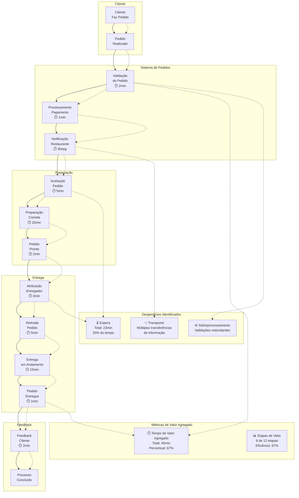
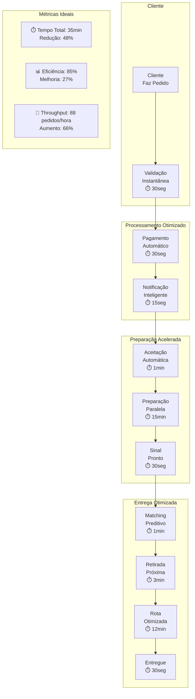

# Mapa de Fluxo de Valor (VSM) - Delivery API

Este documento apresenta o Mapa de Fluxo de Valor (Value Stream Map) do sistema de delivery, identificando o fluxo completo de criação de valor desde o pedido do cliente até a entrega final.

## Visão Geral do VSM

O Mapa de Fluxo de Valor identifica os processos que agregam valor ao cliente versus aqueles que geram desperdício, permitindo otimizar o fluxo de entrega.

## Análise Detalhada do Fluxo

### Etapas do Processo

#### 1. Cliente Faz Pedido (Valor Agregado)

- **Atividade**: Cliente seleciona itens e confirma pedido
- **Tempo**: Instantâneo
- **Valor Agregado**: Alto (satisfação da necessidade)
- **Ferramenta**: App/Web Interface

#### 2. Validação do Pedido (Valor Agregado)

- **Atividade**: Verificar cliente, restaurante, produtos e disponibilidade
- **Tempo**: 2 minutos
- **Valor Agregado**: Médio (garante qualidade)
- **Possível Otimização**: Cache de validações frequentes

#### 3. Processamento de Pagamento (Valor Agregado)

- **Atividade**: Autorização e captura do pagamento
- **Tempo**: 1 minuto
- **Valor Agregado**: Alto (confirma transação)
- **Integração**: Gateway de pagamento (Stripe/PagSeguro)

#### 4. Notificação do Restaurante (Transporte - Desperdício)

- **Atividade**: Envio de notificação push/email/SMS
- **Tempo**: 30 segundos
- **Valor Agregado**: Baixo
- **Desperdício**: Comunicação redundante (múltiplos canais)
- **Otimização**: Notificação unificada

#### 5. Aceitação do Pedido (Espera - Desperdício)

- **Atividade**: Restaurante confirma ou rejeita pedido
- **Tempo**: 5 minutos (média)
- **Valor Agregado**: Baixo
- **Desperdício**: Tempo de espera do cliente
- **Otimização**: Auto-aceitação para restaurantes confiáveis

#### 6. Preparação da Comida (Valor Agregado)

- **Atividade**: Cozinha prepara os itens do pedido
- **Tempo**: 20 minutos
- **Valor Agregado**: Alto (produto final)
- **Variabilidade**: Depende da complexidade do pedido

#### 7. Pedido Pronto (Valor Agregado)

- **Atividade**: Confirmação de que pedido está pronto
- **Tempo**: 2 minutos
- **Valor Agregado**: Médio
- **Gatilho**: Notificação automática ao entregador

#### 8. Atribuição de Entregador (Espera - Desperdício)

- **Atividade**: Sistema encontra entregador disponível
- **Tempo**: 3 minutos
- **Valor Agregado**: Baixo
- **Desperdício**: Tempo de espera
- **Otimização**: Matching preditivo baseado em localização

#### 9. Retirada do Pedido (Valor Agregado)

- **Atividade**: Entregador retira pedido no restaurante
- **Tempo**: 5 minutos
- **Valor Agregado**: Médio
- **Variabilidade**: Distância restaurante-entregador

#### 10. Entrega em Andamento (Valor Agregado)

- **Atividade**: Transporte até o cliente
- **Tempo**: 15 minutos
- **Valor Agregado**: Alto (entrega final)
- **Tracking**: GPS em tempo real

#### 11. Pedido Entregue (Valor Agregado)

- **Atividade**: Confirmação de entrega
- **Tempo**: 1 minuto
- **Valor Agregado**: Alto (satisfação do cliente)

#### 12. Feedback do Cliente (Valor Agregado)

- **Atividade**: Cliente avalia experiência
- **Tempo**: 2 minutos
- **Valor Agregado**: Médio (dados para melhoria)

## Métricas de Desempenho

### Lead Time (Tempo Total)

- **Atual**: 68 minutos (1h 8min)
- **Valor Agregado**: 45 minutos (67%)
- **Desperdício**: 23 minutos (33%)

### Cycle Time (Tempo de Processamento)

- **Atual**: 45 minutos
- **Otimização Potencial**: 35 minutos (-22%)

### Throughput

- **Pedidos/Hora**: ~53 pedidos
- **Capacidade Máxima**: ~88 pedidos/hora (com otimização)

## Oportunidades de Melhoria

### 1. Redução de Esperas

- **Auto-aceitação** para restaurantes com alta taxa de aprovação
- **Matching inteligente** de entregadores baseado em localização
- **Cache de validações** para reduzir tempo de processamento

### 2. Eliminação de Transporte

- **Notificação unificada** (um canal ao invés de múltiplos)
- **API direta** entre sistemas (reduzir intermediários)

### 3. Redução de Sobreprocessamento

- **Validação inteligente** baseada em histórico do cliente
- **Regras de negócio otimizadas** para casos frequentes

## VSM Futuro (Estado Ideal)

## Implementação das Melhorias

### Fase 1: Otimizações Imediatas (1-2 semanas)

- Implementar cache de validações
- Otimizar notificações (canal único)
- Melhorar algoritmo de matching de entregadores

### Fase 2: Melhorias de Processo (2-4 semanas)

- Auto-aceitação para restaurantes premium
- Validação inteligente baseada em histórico
- Roteirização otimizada para entregas

### Fase 3: Transformação Digital (1-2 meses)

- IA para predição de demanda
- Matching em tempo real
- Sistema de auto-escala baseado em demanda

## Monitoramento Contínuo

### KPIs Principais

- **Lead Time**: Tempo total do pedido à entrega
- **Cycle Time**: Tempo de processamento ativo
- **Taxa de Satisfação**: Feedback dos clientes
- **Taxa de Conclusão**: Pedidos entregues com sucesso

### Alertas e Thresholds

- Lead Time > 60min: Alerta amarelo
- Lead Time > 90min: Alerta vermelho
- Taxa de satisfação < 4.0: Investigação necessária
- Taxa de conclusão < 95%: Ação corretiva imediata

Este VSM serve como base para melhorias contínuas no processo de delivery, focando na eliminação de desperdícios e maximização do valor entregue ao cliente.
