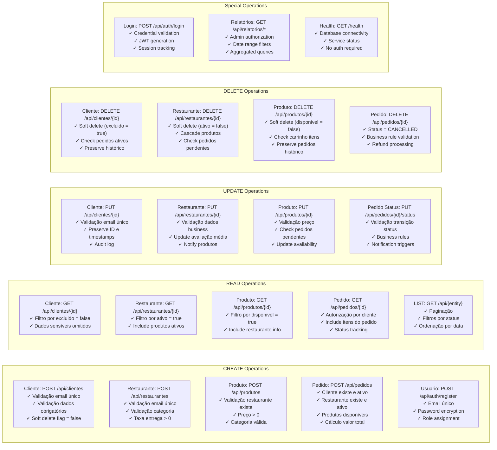

# Mapa de Transações CRUD - Delivery API

Este documento descreve todas as operações CRUD disponíveis no sistema, organizadas por entidade e tipo de operação.

## Operações CRUD por Entidade

```mermaid
graph TD
    subgraph "Cliente Operations"
        CC[ClienteController]
        CC --> C_CREATE["POST /api/clientes\nCriar cliente"]
        CC --> C_READ["GET /api/clientes/{id}\nBuscar cliente"]
        CC --> C_LIST["GET /api/clientes\nListar clientes"]
        CC --> C_UPDATE["PUT /api/clientes/{id}\nAtualizar cliente"]
        CC --> C_DELETE["DELETE /api/clientes/{id}\nSoft delete cliente"]
        
        C_CREATE --> CS[ClienteService]
        C_READ --> CS
        C_LIST --> CS
        C_UPDATE --> CS
        C_DELETE --> CS
        
        CS --> CR[ClienteRepository]
        CR --> CDB[(Cliente Table)]
    end
    
    subgraph "Restaurante Operations"
        RC[RestauranteController]
        RC --> R_CREATE["POST /api/restaurantes\nCriar restaurante"]
        RC --> R_READ["GET /api/restaurantes/{id}\nBuscar restaurante"]
        RC --> R_LIST["GET /api/restaurantes\nListar restaurantes"]
        RC --> R_UPDATE["PUT /api/restaurantes/{id}\nAtualizar restaurante"]
        RC --> R_DELETE["DELETE /api/restaurantes/{id}\nSoft delete restaurante"]
        
        R_CREATE --> RS[RestauranteService]
        R_READ --> RS
        R_LIST --> RS
        R_UPDATE --> RS
        R_DELETE --> RS
        
        RS --> RR[RestauranteRepository]
        RR --> RDB[(Restaurante Table)]
    end
    
    subgraph "Produto Operations"
        PC[ProdutoController]
        PC --> P_CREATE["POST /api/produtos\nCriar produto"]
        PC --> P_READ["GET /api/produtos/{id}\nBuscar produto"]
        PC --> P_LIST["GET /api/produtos\nListar produtos"]
        PC --> P_UPDATE["PUT /api/produtos/{id}\nAtualizar produto"]
        PC --> P_DELETE["DELETE /api/produtos/{id}\nSoft delete produto"]
        
        P_CREATE --> PS[ProdutoService]
        P_READ --> PS
        P_LIST --> PS
        P_UPDATE --> PS
        P_DELETE --> PS
        
        PS --> PR[ProdutoRepository]
        PR --> PDB[(Produto Table)]
    end
    
    subgraph "Pedido Operations"
        PedC[PedidoController]
        PedC --> Ped_CREATE["POST /api/pedidos\nCriar pedido"]
        PedC --> Ped_READ["GET /api/pedidos/{id}\nBuscar pedido"]
        PedC --> Ped_LIST["GET /api/pedidos\nListar pedidos"]
        PedC --> Ped_UPDATE["PUT /api/pedidos/{id}/status\nAtualizar status"]
        PedC --> Ped_CANCEL["DELETE /api/pedidos/{id}\nCancelar pedido"]
        
        Ped_CREATE --> PedS[PedidoService]
        Ped_READ --> PedS
        Ped_LIST --> PedS
        Ped_UPDATE --> PedS
        Ped_CANCEL --> PedS
        
        PedS --> PedR[PedidoRepository]
        PedR --> PedDB[(Pedido Table)]
        PedR --> ItemDB[(ItemPedido Table)]
    end

    subgraph "Authentication Operations"
        AC[AuthController]
        AC --> A_LOGIN["POST /api/auth/login\nAutenticar usuário"]
        AC --> A_REGISTER["POST /api/auth/register\nRegistrar usuário"]
        
        A_LOGIN --> US[UsuarioService]
        A_REGISTER --> US
        
        US --> UR[UsuarioRepository]
        UR --> UDB[(Usuario Table)]
    end
```



## Mapa de Transações Detalhado



## Descrição Detalhada das Operações

### CLIENTE - Operações CRUD

#### CREATE - POST /api/clientes
**Endpoint:** `POST /api/clientes`
**Autenticação:** JWT obrigatório
**Autorização:** Qualquer usuário autenticado

**Validações:**
- Email deve ser único no sistema
- Campos obrigatórios: nome, email, telefone
- Formato válido para email e telefone
- Endereço completo obrigatório

**Transação:**
1. Validar dados de entrada
2. Verificar email duplicado
3. Criar entidade Cliente com `excluido = false`
4. Salvar no banco de dados
5. Retornar ClienteResponse

#### READ - GET /api/clientes/{id}
**Endpoint:** `GET /api/clientes/{id}`
**Autenticação:** JWT obrigatório

**Regras:**
- Retorna apenas clientes não excluídos (`excluido = false`)
- Inclui dados do endereço
- Omite informações sensíveis

#### READ ALL - GET /api/clientes
**Endpoint:** `GET /api/clientes`
**Autenticação:** JWT obrigatório

**Features:**
- Paginação automática
- Filtro por status (ativo/inativo)
- Ordenação por data de criação
- Busca por nome ou email (opcional)

#### UPDATE - PUT /api/clientes/{id}
**Endpoint:** `PUT /api/clientes/{id}`
**Autenticação:** JWT obrigatório

**Validações:**
- Cliente deve existir e não estar excluído
- Email único (exceto o próprio)
- Preserve ID e timestamps originais
- Auditoria de alterações

#### DELETE - DELETE /api/clientes/{id}
**Endpoint:** `DELETE /api/clientes/{id}`
**Autenticação:** JWT obrigatório

**Regras:**
- Soft delete: `excluido = true`
- Verificar se não há pedidos ativos
- Preservar histórico de pedidos
- Não permitir exclusão se houver dependências ativas

### RESTAURANTE - Operações CRUD

#### CREATE - POST /api/restaurantes
**Endpoint:** `POST /api/restaurantes`
**Autenticação:** JWT obrigatório
**Autorização:** ADMIN ou RESTAURANTE

**Validações:**
- Email único por restaurante
- Categoria válida (enum predefinido)
- Taxa de entrega >= 0
- Tempo de entrega > 0
- Coordenadas GPS válidas (opcional)

#### READ - GET /api/restaurantes/{id}
**Endpoint:** `GET /api/restaurantes/{id}`
**Autenticação:** Não obrigatório (público)

**Features:**
- Filtro por `ativo = true`
- Incluir produtos ativos
- Cálculo de avaliação média
- Informações de entrega

#### UPDATE - PUT /api/restaurantes/{id}
**Endpoint:** `PUT /api/restaurantes/{id}`
**Autenticação:** JWT obrigatório
**Autorização:** ADMIN ou próprio restaurante

**Regras:**
- Validação de dados business
- Recalcular avaliação média
- Notificar produtos sobre mudanças
- Audit trail completo

#### DELETE - DELETE /api/restaurantes/{id}
**Endpoint:** `DELETE /api/restaurantes/{id}`
**Autenticação:** JWT obrigatório
**Autorização:** ADMIN

**Regras:**
- Soft delete: `ativo = false`
- Desativar produtos em cascata
- Verificar pedidos pendentes
- Não permitir se houver pedidos em andamento

### PRODUTO - Operações CRUD

#### CREATE - POST /api/produtos
**Endpoint:** `POST /api/produtos`
**Autenticação:** JWT obrigatório
**Autorização:** ADMIN ou RESTAURANTE (próprio)

**Validações:**
- Restaurante deve existir e estar ativo
- Preço > 0
- Categoria válida
- Descrição obrigatória
- Imagem (URL válida, opcional)

#### READ - GET /api/produtos/{id}
**Endpoint:** `GET /api/produtos/{id}`
**Autenticação:** Não obrigatório

**Features:**
- Filtro por `disponivel = true`
- Incluir informações do restaurante
- Preço formatado
- Disponibilidade em tempo real

#### UPDATE - PUT /api/produtos/{id}
**Endpoint:** `PUT /api/produtos/{id}`
**Autenticação:** JWT obrigatório
**Autorização:** ADMIN ou RESTAURANTE proprietário

**Regras:**
- Validar alterações de preço
- Verificar impacto em pedidos pendentes
- Atualizar disponibilidade
- Histórico de alterações de preço

#### DELETE - DELETE /api/produtos/{id}
**Endpoint:** `DELETE /api/produtos/{id}`
**Autenticação:** JWT obrigatório
**Autorização:** ADMIN ou RESTAURANTE proprietário

**Regras:**
- Soft delete: `disponivel = false`
- Verificar itens em carrinhos ativos
- Preservar histórico em pedidos
- Impedir exclusão se em pedidos pendentes

### PEDIDO - Operações CRUD

#### CREATE - POST /api/pedidos
**Endpoint:** `POST /api/pedidos`
**Autenticação:** JWT obrigatório
**Autorização:** CLIENTE autenticado

**Validações Complexas:**
1. Cliente deve estar ativo (`excluido = false`)
2. Restaurante deve estar ativo
3. Todos os produtos devem estar disponíveis
4. Quantidades válidas (> 0)
5. Cálculo automático do valor total
6. Geração de número único do pedido
7. Status inicial: PENDENTE

**Transação:**
```sql
BEGIN TRANSACTION
  -- Validar cliente
  SELECT * FROM clientes WHERE id = ? AND excluido = false
  
  -- Validar restaurante  
  SELECT * FROM restaurantes WHERE id = ? AND ativo = true
  
  -- Validar produtos (loop)
  SELECT * FROM produtos WHERE id IN (?) AND disponivel = true
  
  -- Calcular valor total
  -- Criar pedido
  INSERT INTO pedidos (...)
  
  -- Criar itens do pedido
  INSERT INTO itens_pedido (...)
COMMIT
```

#### READ - GET /api/pedidos/{id}
**Endpoint:** `GET /api/pedidos/{id}`
**Autenticação:** JWT obrigatório
**Autorização:** CLIENTE proprietário, RESTAURANTE, ENTREGADOR, ADMIN

**Features:**
- Incluir itens do pedido com detalhes dos produtos
- Status tracking completo
- Informações de entrega
- Histórico de mudanças de status

#### UPDATE STATUS - PUT /api/pedidos/{id}/status
**Endpoint:** `PUT /api/pedidos/{id}/status`
**Autenticação:** JWT obrigatório
**Autorização:** RESTAURANTE, ENTREGADOR, ADMIN

**Transições de Status Válidas:**
```
PENDENTE → CONFIRMADO (Restaurante)
CONFIRMADO → PREPARANDO (Restaurante)
PREPARANDO → PRONTO (Restaurante)
PRONTO → SAIU_ENTREGA (Entregador)
SAIU_ENTREGA → ENTREGUE (Entregador)

Qualquer status → CANCELADO (Admin ou regras específicas)
```

**Regras de Negócio:**
- Validar transição de status permitida
- Registrar timestamps de cada mudança
- Notificações automáticas (futuro)
- Regras específicas por role

#### CANCEL - DELETE /api/pedidos/{id}
**Endpoint:** `DELETE /api/pedidos/{id}`
**Autenticação:** JWT obrigatório
**Autorização:** CLIENTE proprietário (se PENDENTE), ADMIN

**Regras:**
- Clientes podem cancelar apenas pedidos PENDENTES
- Admin pode cancelar qualquer status (com restrições)
- Status final: CANCELADO
- Processamento de estorno (futuro)
- Não exclusão física do registro

### AUTENTICAÇÃO - Operações Especiais

#### LOGIN - POST /api/auth/login
**Endpoint:** `POST /api/auth/login`
**Autenticação:** Não obrigatório
**Rate Limiting:** 5 tentativas por minuto por IP

**Processo:**
1. Validar formato email/senha
2. Buscar usuário no banco
3. Verificar senha com BCrypt
4. Gerar token JWT
5. Registrar login (audit)
6. Retornar token e dados básicos

#### REGISTER - POST /api/auth/register
**Endpoint:** `POST /api/auth/register`
**Autenticação:** Não obrigatório

**Validações:**
- Email único no sistema
- Senha forte (regex)
- Role válida (default: CLIENTE)
- Termos de uso aceitos
- Verificação de email (futuro)

### RELATÓRIOS - Operações de Leitura

#### Vendas por Período
**Endpoint:** `GET /api/relatorios/vendas`
**Autenticação:** JWT obrigatório
**Autorização:** ADMIN apenas

**Parâmetros:**
- dataInicio (obrigatório)
- dataFim (obrigatório)
- restauranteId (opcional)
- status (opcional)

**Consulta Otimizada:**
```sql
SELECT 
  DATE(p.data_criacao) as data,
  COUNT(*) as total_pedidos,
  SUM(p.valor_total) as faturamento,
  AVG(p.valor_total) as ticket_medio
FROM pedidos p 
WHERE p.data_criacao BETWEEN ? AND ?
  AND p.status != 'CANCELADO'
GROUP BY DATE(p.data_criacao)
ORDER BY data DESC
```

## Regras de Negócio Transversais

### Soft Delete Pattern
- Todos os CRUDs principais usam soft delete
- Campos: `excluido`, `ativo`, `disponivel`
- Preservação de integridade referencial
- Consultas sempre filtram registros deletados

### Auditoria
- Timestamps automáticos: `dataCriacao`, `dataAtualizacao`
- Usuário responsável pela operação (JWT)
- Log de operações críticas
- Versionamento de entidades importantes

### Transações e Consistência
- `@Transactional` em operações de escrita
- `@Transactional(readOnly=true)` em consultas
- Rollback automático em exceções
- Controle de concorrência otimista (futuro)

### Segurança
- JWT obrigatório (exceto endpoints públicos)
- Autorização baseada em roles
- Validação de propriedade de recursos
- Rate limiting em endpoints sensíveis

### Performance
- Paginação obrigatória em listagens
- Fetch joins para evitar N+1
- Índices em campos de busca frequente
- Cache em consultas pesadas (futuro)