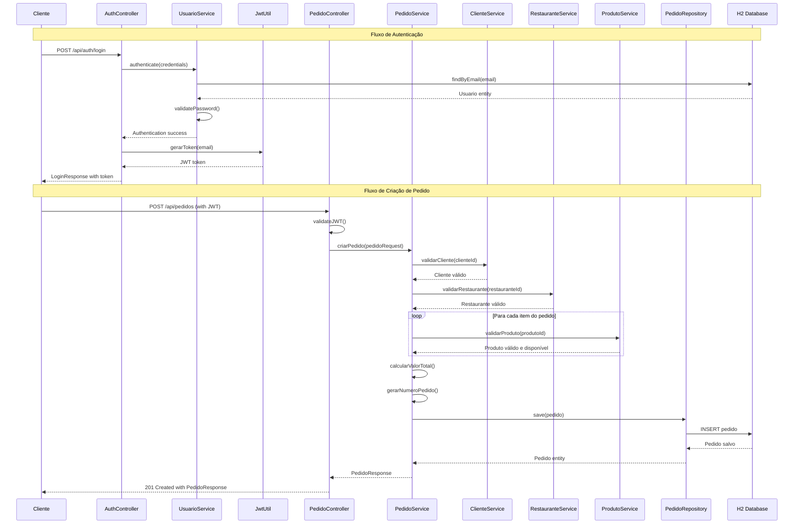
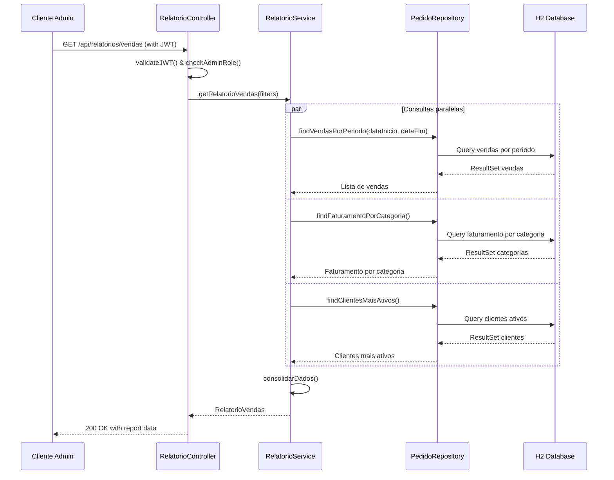
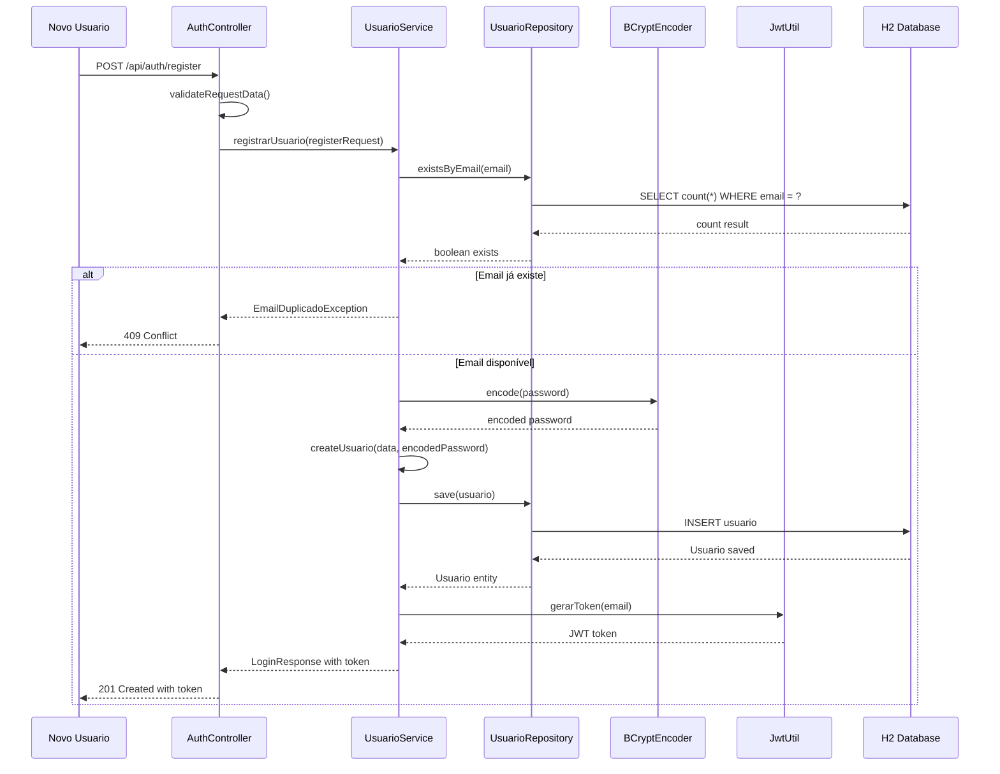
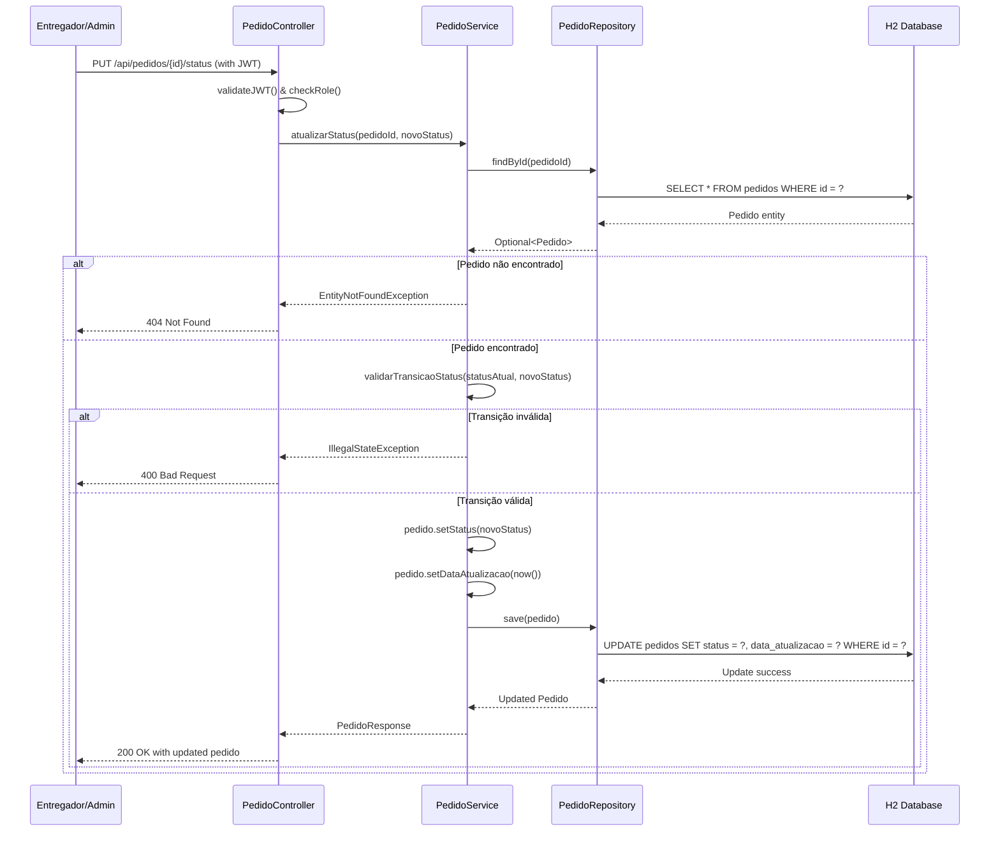

# Diagrama de Sequência - Delivery API

Este diagrama mostra os principais fluxos de interação no sistema de delivery API.

## Fluxo de Autenticação e Criação de Pedido

## Fluxo de Consulta de Relatórios

## Fluxo de Registro de Usuário

## Fluxo de Atualização de Status do Pedido

## Descrição dos Fluxos

### 1. Fluxo de Autenticação e Criação de Pedido
- Demonstra o processo completo desde login até criação de pedido
- Inclui validação JWT e regras de negócio
- Mostra as validações em cascata (cliente, restaurante, produtos)

### 2. Fluxo de Consulta de Relatórios
- Mostra como funciona a autorização por role (ADMIN)
- Demonstra consultas paralelas para performance
- Inclui agregação de dados de múltiplas fontes

### 3. Fluxo de Registro de Usuário
- Processo de criação de nova conta
- Validação de email duplicado
- Criptografia de senha e geração de token

### 4. Fluxo de Atualização de Status do Pedido
- Demonstra autorização por role específica
- Validação de transições de status
- Tratamento de erros e exceções